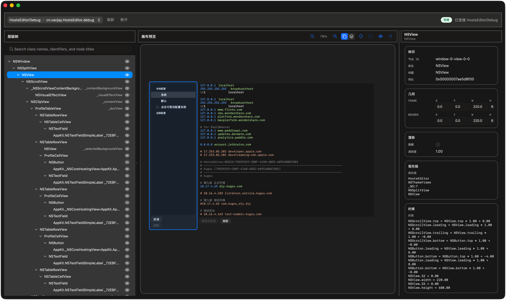
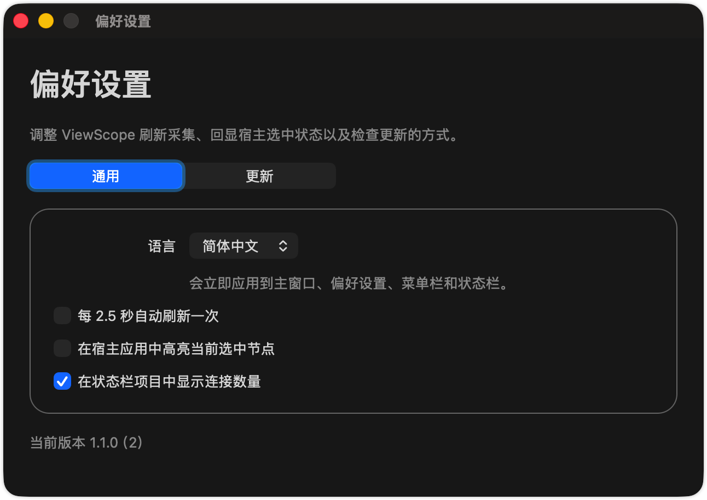

# ViewScope

ViewScope 是一个面向原生 macOS 开发的 UI 调试工具，目标是在 AppKit 项目里提供类似 Lookin / Reveal 的实时层级查看、属性检查、截图预览与节点高亮体验，同时尽量保持集成成本低、数据只在本机流动。

## 特性

- 原生 AppKit 客户端，支持主窗口、状态栏入口、偏好设置与 Sparkle 更新检查
- 自动发现本机 Debug 宿主，使用 `DistributedNotificationCenter` 广播 + `127.0.0.1` TCP 握手通信
- 层级树搜索、属性面板、约束列表、局部截图预览、节点高亮
- 通过 GRDB 记录最近连接宿主与捕获耗时，用于会话历史和性能洞察
- `ViewScopeServer` 同时支持 Swift Package Manager、CocoaPods、Carthage
- 自带 DMG、GitHub Release、Sparkle appcast 脚本，方便继续发布后续版本

## 截图

<p>
  
</p>
<p>
  
</p>

## 项目结构

- `ViewScope/`: 主应用工程，使用 SnapKit、GRDB、Sparkle 和本地 `ViewScopeServer` 包
- `ViewScopeServer/`: 宿主侧运行时，包含源码、CocoaPods podspec、Carthage framework 工程
- `Package.swift`: 仓库根目录的 SwiftPM 入口，对外暴露 `ViewScopeServer`
- `READMEAssets/`: README 截图资源，由测试自动生成
- `scripts/`: DMG、GitHub Release、Sparkle appcast 脚本
- `release-notes/`: 每个版本的发布说明

## 本地开发

要求：

- macOS 11.0+
- Xcode（当前仓库已在本机 Xcode 17C529 环境完成构建与测试）

日常开发建议直接打开 `ViewScope/ViewScope.xcodeproj`。若只验证宿主侧库，也可以直接使用根目录 `Package.swift` 或 `ViewScopeServer/Package.swift`。

常用命令：

```bash
xcodebuild \
  -project ViewScope/ViewScope.xcodeproj \
  -scheme ViewScope \
  -destination 'platform=macOS' \
  test

swift test
swift test --package-path ViewScopeServer

xcodebuild \
  -project ViewScopeServer/ViewScopeServer.xcodeproj \
  -scheme ViewScopeServer \
  -destination 'generic/platform=macOS' \
  build CODE_SIGNING_ALLOWED=NO
```

## 集成 ViewScopeServer

### Swift Package Manager

```swift
.package(url: "https://github.com/wangwanjie/ViewScope.git", from: "1.1.0")
```

仓库根目录直接提供 `Package.swift`，Xcode / SwiftPM 可以直接依赖整个仓库 URL，无需指向 `ViewScopeServer/` 子目录。

把 `ViewScopeServer` product 加到 Debug 宿主 target：

```swift
import ViewScopeServer
```

默认情况下，只要库被加载到 Debug 构建中，`ViewScopeServer` 会在宿主应用完成启动后自动启用。

如果你想自己控制启用时机，可以在很早期先关闭自动启用，再在合适的时机手动调用 `start()`：

```swift
import ViewScopeServer

@main
struct DemoApp: App {
    init() {
        ViewScopeInspector.disableAutomaticStart()
    }

    var body: some Scene {
        WindowGroup {
            ContentView()
                .task {
                    ViewScopeInspector.start()
                }
        }
    }
}
```

如果你的 macOS Debug 宿主启用了 `App Sandbox`，请先把 Debug 配置里的 `ENABLE_APP_SANDBOX` 关掉。当前发现层使用 `DistributedNotificationCenter`，而系统默认的 app sandbox 不允许普通应用发送这类 discovery 广播，所以客户端会一直看不到 `Live Hosts`。

### CocoaPods

```ruby
pod 'ViewScopeServer', :git => 'https://github.com/wangwanjie/ViewScope.git', :tag => 'v1.1.0', :configurations => ['Debug']
```

### Carthage

```ruby
github "wangwanjie/ViewScope" ~> 1.1
```

然后执行：

```bash
carthage update --use-xcframeworks --platform macOS
```

将生成的 `ViewScopeServer.framework` 链接到 Debug 宿主即可；默认会在启动完成后自动启用。

## 使用方式

1. 启动 ViewScope。
2. 运行已集成 `ViewScopeServer` 的 Debug 宿主应用。
3. 在左侧 `Live Hosts` 里选择宿主，ViewScope 会通过 loopback 建立连接。
4. 在层级树中搜索或选中节点，右侧会显示属性、约束和截图预览。
5. 需要时可通过主窗口按钮或状态栏菜单触发刷新和高亮。

## 状态栏设计

ViewScope 会常驻一个 `VS` 状态栏入口：

- 实时显示当前是否已连接宿主
- 直接打开主窗口、刷新当前捕获、开关自动刷新和自动高亮
- 展示最近发现的本机宿主列表，便于快速连接
- 提供偏好设置和手动检查更新入口

## 安全与性能

- 发现和采集数据默认只在本机传输，不依赖远端服务
- 宿主监听地址固定在 `127.0.0.1`，并使用一次性 token 完成握手
- 默认只建议在 Debug 构建里启用 `ViewScopeServer`
- 对于 sandboxed 的 macOS 宿主，建议专门准备一个关闭 `App Sandbox` 的 Debug 配置
- 捕获历史限制为最近 250 条，避免数据库持续膨胀

## 发布

版本号来源：

- 主应用：`ViewScope/ViewScope.xcodeproj/project.pbxproj`
- 宿主 framework：`ViewScopeServer/ViewScopeServer.xcodeproj/project.pbxproj`
- CocoaPods / runtime：`ViewScopeServer/ViewScopeServer.podspec`

常用脚本：

```bash
./scripts/build_dmg.sh
./scripts/publish_github_release.sh --notes-file release-notes/v1.1.0.md
./scripts/generate_appcast.sh --archive build/dmg/ViewScope_V_1.1.0.dmg --notes-file release-notes/v1.1.0.md
```

其中：

- `build_dmg.sh` 会构建通用二进制、重新签名、生成 DMG，并默认提交 notarization
- `publish_github_release.sh` 会创建或更新 GitHub Release，并同步刷新 `appcast.xml`
- `generate_appcast.sh` 会把发布说明内嵌到 Sparkle feed，避免额外跳网页

## 备注

- `ViewScopeServer/README.md` 提供宿主侧更聚焦的说明
- `READMEAssets/` 中的截图由测试自动生成，可通过 `ViewScopeTests.renderReadmeScreenshots` 刷新
